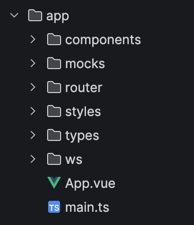
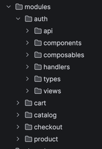
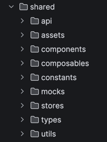
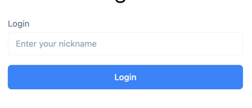
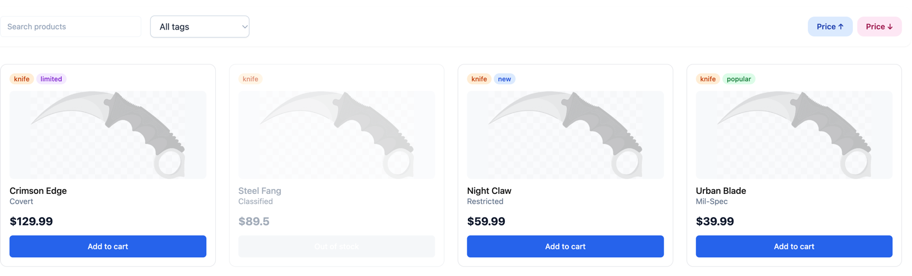
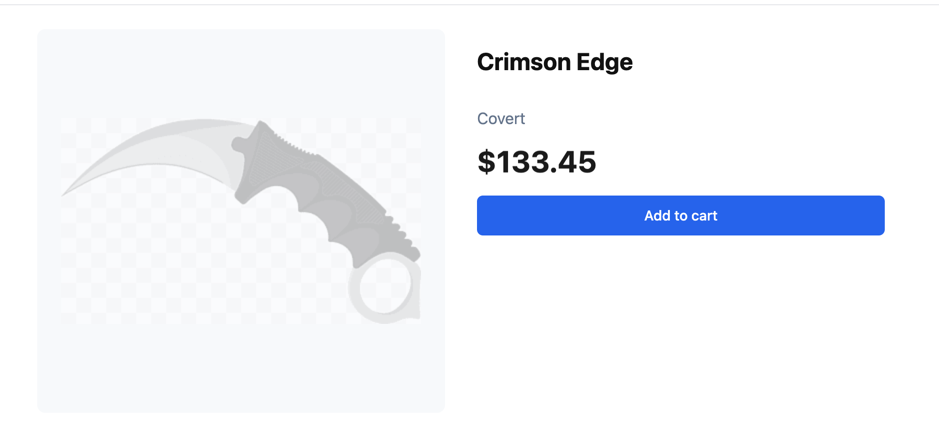
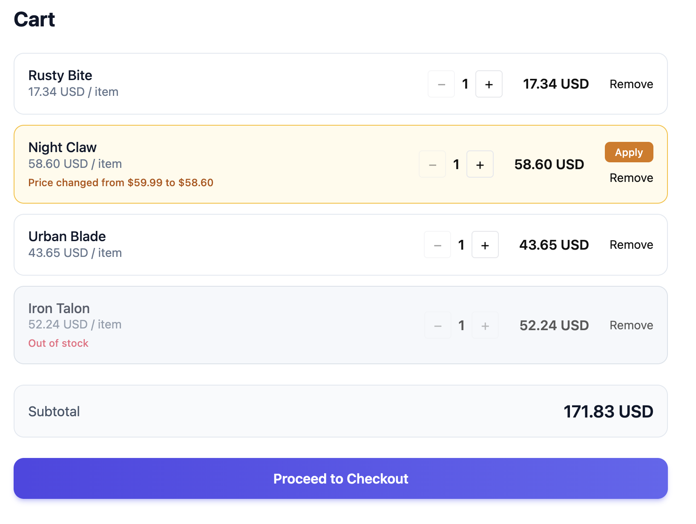
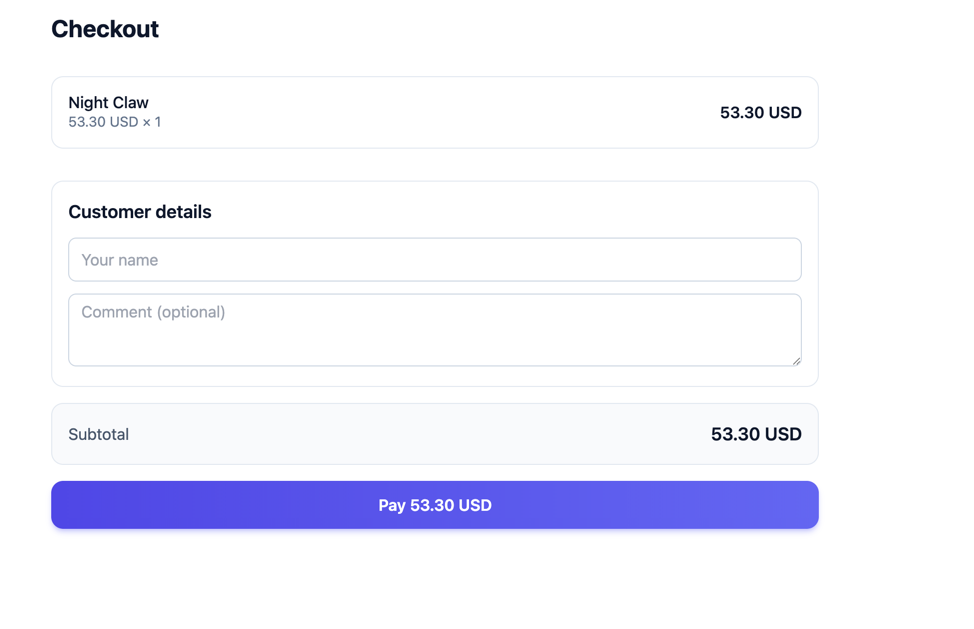

# Knife Store

Тестовое задание с каталогом, корзиной и чекаутом.

---

## Как запустить проект

```bash
pnpm install
pnpm dev
```

### Настройка WebSocket

Поведение WebSocket в каталоге, настраивается через файл `.env`:

```env
VITE_WS_PRODUCT_INDEX=1
```

- По умолчанию обновляется второй продукт в списке, чтобы было наглядно видно обновления UI.
- Если переменную удалить, обновления будут применяться к случайному продукту.

---

## Архитектура

Проект содержит три основные директории:

### app
- конфигурация окружения
- настройка WebSocket
- настройка MSW
- инициализация приложения



### modules
- страницы приложения
- логика, связанная со страницами
- одинаковая структура для всех страниц



### shared
- переиспользуемые UI-компоненты
- composables
- API-клиенты
- общие типы и утилиты



---

## Реализованный функционал

### Логин
- Можно ввести имя пользователя
- Можно оставить поле пустым, пользователь будет считаться анонимным



### Каталог
- Фильтры
- Поиск
- Пагинация
- Обновление продуктов через WebSocket, по-умолчанию обновляет 2ой товар



### Страница продукта
- Обновление цены
- Обновление поля `inStock
- WebSocket обновляет цену и наличие товара через определенный интервал (каждые 7 секунд, для наглядности)



### Корзина
- Для наглядности может обновляться любой элемент корзины
- Обновляются цена и наличие
- Корзина синхронизируется через WebSocket и MSW
- Websocket обновляет случайный товар из корзины меняя цену либо наличие (каждые 10 секунд)



### Чекаут

- Ошибки приходят с backend API
- После успешной покупки:
  - корзина очищается
  - происходит редирект на главную страницу


---

## Затраченное время

Общее время выполнения: 10 часов

---

## Сложности

В качестве mock-базы данных для корзины использовался `localStorage`.
Он не используется напрямую на фронте, доступ к нему происходит через WebSocket handlers и MSW.

Такой подход оказался не самым удачным, так как WebSocket не гарантирует синхронность состояния.
WebSocket возвращает корзину, которую необходимо мержить с текущим состоянием, при этом MSW также возвращает обновлённую корзину.

Если события происходят одновременно (например, удаление элемента и обновление через WS),
элемент мог исчезнуть, а затем снова появиться.

Проблема была исправлена, но это привело к:
- усложнению логики синхронизации
- увеличению объёма кода
- разрастанию store, который требует декомпозиции

---

## Возможные улучшения

- Пересмотреть архитектуру WebSocket и точки синхронизации
- Привести типы к единому виду и убрать дублирование
- Добавить изображения продуктов (сейчас используются заглушки)
- Сделать дизайн-систему для унификации интерфейса

При наличии большего времени кодовую базу можно было бы сократить примерно на 30%.
